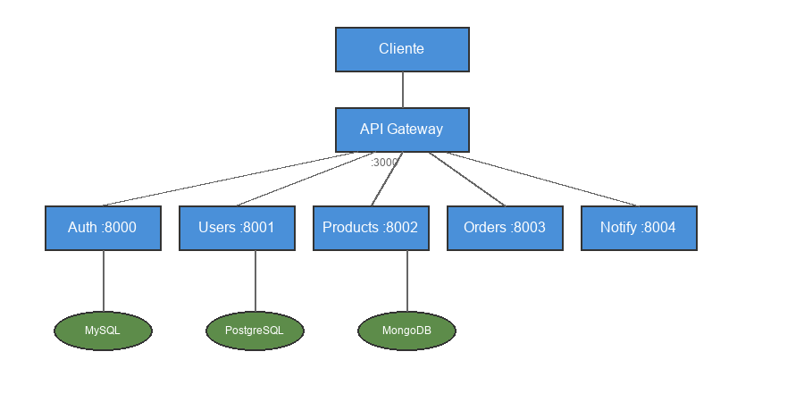

# Sistema de Microservicios - Ingeniería de Software II

## Autor

Estudiante: 1053863699

## Descripción del Proyecto

Este proyecto consiste en el desarrollo de un sistema basado en arquitectura de microservicios que implementa funcionalidades básicas de un e-commerce, incluyendo gestión de usuarios, productos, órdenes y notificaciones. Todas las peticiones externas pasan obligatoriamente por un API Gateway centralizado, lo que garantiza un punto único de entrada y control sobre el tráfico hacia los diferentes servicios.

## Arquitectura del Sistema

El sistema está compuesto por cinco microservicios independientes que se comunican entre sí a través de APIs REST. A continuación se presenta el diagrama de la arquitectura general:



### Tecnologías Utilizadas

El proyecto utiliza diferentes frameworks y tecnologías según lo solicitado en los requisitos:

| Componente | Tecnología |
|------------|------------|
| API Gateway | Express.js (Node.js) |
| Auth Service | Node.js (Express) |
| User Service | Django (Python) |
| Product Service | Flask (Python) |
| Order Service | Express.js (Node.js) |
| Notification Service | Flask (Python) |
| Base de datos principal | MySQL 8 |
| Base de datos secundaria | PostgreSQL 15 |
| Base de datos NoSQL | MongoDB 6 |
| Contenerización | Docker y Docker Compose |
| Pruebas de rendimiento | Locust |

---

## Instrucciones de Despliegue

### Prerrequisitos

Antes de ejecutar el proyecto, asegúrese de tener instalado lo siguiente:

- Docker Desktop
- Docker Compose
- Git

### Pasos de Instalación

1. Clone el repositorio:
```bash
git clone <url-del-repositorio>
cd ProyectoSoftware2
```

2. Construya y levante los contenedores:
```bash
docker-compose up --build
```

3. Verifique que todos los servicios estén corriendo correctamente:
```bash
docker-compose ps
```

4. Pruebe que el API Gateway responde correctamente:
```bash
curl http://localhost:3000/
```

### Puertos de los Servicios

Cada servicio expone un puerto diferente para su acceso:

| Servicio | Puerto | URL de acceso |
|----------|--------|---------------|
| API Gateway | 3000 | http://localhost:3000 |
| Auth Service | 8000 | http://localhost:8000 |
| User Service | 8001 | http://localhost:8001 |
| Product Service | 8002 | http://localhost:8002 |
| Order Service | 8003 | http://localhost:8003 |
| Notification Service | 8004 | http://localhost:8004 |
| MySQL | 3307 | localhost:3307 |
| PostgreSQL | 5432 | localhost:5432 |
| MongoDB | 27017 | localhost:27017 |

---

## Documentación de Endpoints

Todas las peticiones deben realizarse a través del API Gateway, el cual se encarga de enrutarlas al microservicio correspondiente.

### Autenticación

Los endpoints de autenticación permiten gestionar el acceso de los usuarios al sistema.

#### POST /auth/login

Inicia sesión con las credenciales del usuario.

**Cuerpo de la petición:**
```json
{
  "email": "usuario@test.com",
  "password": "123456"
}
```

**Ejemplo:**
```bash
curl -X POST http://localhost:3000/auth/login \
  -H "Content-Type: application/json" \
  -d '{"email": "usuario@test.com", "password": "123456"}'
```

**Respuesta:**
```json
{
  "message": "login ok"
}
```

#### POST /auth/logout

Cierra la sesión del usuario.

**Cuerpo de la petición:**
```json
{
  "token": "token-de-sesion"
}
```

**Ejemplo:**
```bash
curl -X POST http://localhost:3000/auth/logout \
  -H "Content-Type: application/json" \
  -d '{"token": "test-token"}'
```

**Respuesta:**
```json
{
  "message": "logout ok"
}
```

#### POST /auth/recover

Inicia el proceso de recuperación de contraseña.

**Cuerpo de la petición:**
```json
{
  "email": "usuario@test.com"
}
```

**Ejemplo:**
```bash
curl -X POST http://localhost:3000/auth/recover \
  -H "Content-Type: application/json" \
  -d '{"email": "usuario@test.com"}'
```

**Respuesta:**
```json
{
  "message": "recover ok"
}
```

### Usuarios

#### GET /users

Obtiene la lista de usuarios registrados en el sistema.

**Ejemplo:**
```bash
curl http://localhost:3000/users
```

**Respuesta:**
```json
{
  "users": []
}
```

### Productos

#### GET /products

Obtiene el catálogo de productos disponibles.

**Ejemplo:**
```bash
curl http://localhost:3000/products
```

**Respuesta:**
```json
[]
```

### Ordenes

#### GET /orders

Obtiene la lista de órdenes registradas.

**Ejemplo:**
```bash
curl http://localhost:3000/orders
```

**Respuesta:**
```json
{
  "orders": []
}
```

### Notificaciones

#### GET /notify

Envía una notificación de prueba.

**Ejemplo:**
```bash
curl http://localhost:3000/notify
```

**Respuesta:**
```json
{
  "message": "notification sent"
}
```

---

## Pruebas de Rendimiento

El proyecto incluye un conjunto completo de pruebas de rendimiento implementadas con Locust. Estas pruebas permiten evaluar el comportamiento del sistema bajo diferentes condiciones de carga.

### Instalación de Locust

Para ejecutar las pruebas, primero instale Locust:

```bash
pip install locust
```

### Ejecución de las Pruebas

1. Asegúrese de que todos los servicios estén corriendo:
```bash
docker-compose up -d
```

2. Ejecute Locust con el archivo de configuración:
```bash
locust -f locustfile.py --host=http://localhost:3000
```

3. Abra la interfaz web de Locust en su navegador:
```
http://localhost:8089
```

4. Configure los parámetros de la prueba (número de usuarios, tasa de incremento) y presione "Start swarming".

### Tipos de Pruebas Incluidas

El archivo locustfile.py incluye configuraciones para tres tipos de pruebas:

#### Prueba de Capacidad

Esta prueba determina el límite máximo de usuarios concurrentes que el sistema puede manejar antes de que el rendimiento se degrade significativamente.

Configuración recomendada:
- Número de usuarios: 100
- Tasa de incremento: 10 usuarios por segundo
- Tiempo de ejecución: 5 minutos

#### Prueba de Carga

Evalúa el comportamiento del sistema bajo una carga normal esperada, simulando condiciones típicas de uso.

Configuración recomendada:
- Número de usuarios: 50
- Tasa de incremento: 5 usuarios por segundo
- Tiempo de ejecución: 10 minutos

#### Prueba de Estrés

Somete al sistema a una carga que excede sus límites normales para identificar su punto de fallo y comportamiento bajo condiciones extremas.

Configuración recomendada:
- Número de usuarios: 200
- Tasa de incremento: 20 usuarios por segundo
- Tiempo de ejecución: 3 minutos

### Endpoints Probados

Las pruebas de rendimiento simulan tráfico hacia los siguientes endpoints:

| Endpoint | Peso | Tipo de petición |
|----------|------|------------------|
| /auth/login | 3 | POST |
| /auth/logout | 2 | POST |
| /auth/recover | 1 | POST |
| /users | 4 | GET |
| /products | 5 | GET |
| /orders | 3 | GET |
| /notify | 2 | GET |
| / | 1 | GET |

El peso determina la frecuencia relativa con la que cada endpoint es llamado durante las pruebas.

---

## Estructura del Proyecto

```
ProyectoSoftware2/
├── docker-compose.yml
├── locustfile.py
├── README.md
├── api-gateway/
│   ├── index.js
│   ├── package.json
│   └── Dockerfile
├── auth-service/
│   ├── index.js
│   └── Dockerfile
├── user-service/
│   ├── user_service/
│   ├── manage.py
│   └── Dockerfile
├── product-service/
│   ├── app.py
│   └── Dockerfile
├── order-service/
│   ├── index.js
│   ├── package.json
│   └── Dockerfile
└── notification-service/
    ├── app.py
    └── Dockerfile
```

---

## Comandos Útiles

### Docker

```bash
docker-compose up -d
docker-compose logs -f
docker-compose down
docker-compose up --build
docker-compose down -v
```

### Locust

```bash
locust -f locustfile.py --host=http://localhost:3000
locust -f locustfile.py --host=http://localhost:3000 --headless -u 100 -r 10 -t 5m
```

## Licencia

Este proyecto es de uso académico para la materia de Ingeniería de Software II.