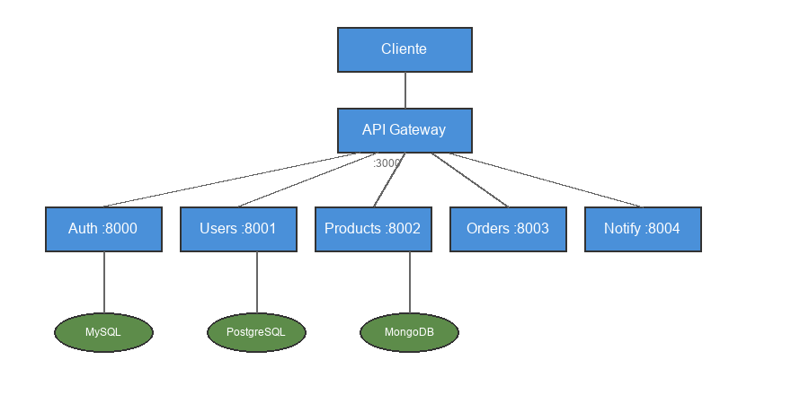

# Sistema de Microservicios - Ingenieria de Software II

## Autor

Estudiante: 1053863699

## Descripcion del Proyecto

Este proyecto consiste en el desarrollo de un sistema basado en arquitectura de microservicios que implementa funcionalidades basicas de un e-commerce, incluyendo gestion de usuarios, productos, ordenes y notificaciones. Todas las peticiones externas pasan obligatoriamente por un API Gateway centralizado, lo que garantiza un punto unico de entrada y control sobre el trafico hacia los diferentes servicios.

---

## Arquitectura del Sistema

El sistema esta compuesto por cinco microservicios independientes que se comunican entre si a traves de APIs REST. A continuacion se presenta el diagrama de la arquitectura general:



### Tecnologias Utilizadas

| Componente | Tecnologia | Framework | Base de Datos |
|------------|------------|-----------|---------------|
| API Gateway | Node.js | Express.js | - |
| Auth Service | PHP 8.4 | Laravel 12 | MySQL 8 |
| User Service | Python 3.10 | Django 5.2 | PostgreSQL 15 |
| Product Service | Python 3.10 | Flask 3.1 | MongoDB 6 |
| Order Service | Node.js 18 | Express.js | en memoria |
| Notification Service | Python 3.10 | Flask 3.1 | en memoria |
| Frontend Web | HTML/CSS/JS | - | - |

### Frameworks utilizados (obligatorios)

- Laravel (PHP) para Auth Service
- Django (Python) para User Service
- Flask (Python) para Product Service y Notification Service
- Express (Node.js) para API Gateway y Order Service

### Bases de datos utilizadas (obligatorias)

- MySQL 8 para Auth Service
- PostgreSQL 15 para User Service
- MongoDB 6 para Product Service

---

## Frontend Web

El sistema incluye una interfaz web completa servida por el API Gateway en http://localhost:3000.

### Funcionalidades publicas (sin login)

- Inicio con hero de bienvenida y productos destacados
- Catalogo de productos completo con buscador y filtro por categorias
- Modal de inicio de sesion con enlace a recuperacion de contrasena
- Modal de registro para nuevos usuarios

### Funcionalidades privadas (con login)

| Seccion | Admin | Usuario normal |
|---------|-------|----------------|
| Dashboard | Estadisticas y estado de servicios | Estadisticas y estado de servicios |
| Usuarios | CRUD completo | Bloqueado - Solo administradores |
| Productos | CRUD completo (crear, editar, eliminar) | Solo lectura |
| Ordenes | CRUD completo | CRUD completo |
| Notificaciones | CRUD completo | CRUD completo |
| Ver Tienda | Volver a la vista publica | Volver a la vista publica |

### Credenciales de prueba

| Rol | Email | Contrasena |
|-----|-------|------------|
| Administrador | admin@test.com | admin123 |
| Usuario normal | user@test.com | user123 |

---

## Instrucciones de Despliegue

### Prerrequisitos

- Docker Desktop
- Docker Compose
- Git

### Pasos para levantar el sistema

1. Clone el repositorio:
```bash
git clone <url-del-repositorio>
cd ProyectoSoftware2
```

2. Construya y levante los contenedores:
```bash
docker compose up --build -d
```

3. Verifique que todos los servicios esten corriendo:
```bash
docker compose ps
```

4. Abra el navegador en:
```
http://localhost:3000
```

### Puertos de los Servicios

| Servicio | Puerto Interno | Puerto Externo |
|----------|---------------|----------------|
| API Gateway | 3000 | 3000 |
| Auth Service | 8000 | solo interno |
| User Service | 8001 | solo interno |
| Product Service | 8002 | solo interno |
| Order Service | 8003 | solo interno |
| Notification Service | 8004 | solo interno |
| MySQL | 3306 | 3307 |
| PostgreSQL | 5432 | 5432 |
| MongoDB | 27017 | 27017 |

Nota: Solo el API Gateway (puerto 3000) esta expuesto al exterior. Los microservicios se comunican internamente a traves de la red de Docker.

---

## Documentacion de Endpoints

Todas las peticiones deben realizarse a traves del API Gateway (http://localhost:3000).

### Autenticacion

#### POST /auth/login

Inicia sesion con credenciales del usuario.

Request:
```json
{
  "email": "admin@test.com",
  "password": "admin123"
}
```

Response (200):
```json
{
  "success": true,
  "token": "eyJlbWFpbCI6ImFkbWluQHRlc3QuY29tIiwicm9sZSI6ImFkbWluIiwibmFtZSI6IkFkbWluIiwiZXhwIjoxNzc4MzUyNzU2fQ==",
  "user": {
    "email": "admin@test.com",
    "role": "admin",
    "name": "Admin"
  }
}
```

Ejemplo:
```bash
curl -X POST http://localhost:3000/auth/login \
  -H "Content-Type: application/json" \
  -d '{"email": "admin@test.com", "password": "admin123"}'
```

#### POST /auth/register

Registra un nuevo usuario en el sistema.

Request:
```json
{
  "name": "Nuevo Usuario",
  "email": "nuevo@test.com",
  "password": "mipassword"
}
```

Response (200):
```json
{
  "success": true,
  "message": "Usuario registrado correctamente"
}
```

#### POST /auth/logout

Cierra la sesion del usuario.

Request:
```json
{
  "token": "token-de-sesion"
}
```

Response (200):
```json
{
  "message": "logout ok"
}
```

#### POST /auth/recover

Inicia el proceso de recuperacion de contrasena.

Request:
```json
{
  "email": "usuario@test.com"
}
```

Response (200):
```json
{
  "message": "recover ok"
}
```

#### GET /auth/verify

Verifica si un token de sesion es valido.

Headers: Authorization: Bearer <token>

Response (200):
```json
{
  "valid": true,
  "user": {
    "email": "admin@test.com",
    "role": "admin",
    "name": "Admin",
    "exp": 1778352756
  }
}
```

---

### Usuarios (User Service - Django)

#### GET /users

Obtiene la lista de usuarios registrados.

```bash
curl http://localhost:3000/users
```

Response:
```json
{
  "users": [
    {
      "id": 1,
      "name": "Juan Perez",
      "email": "juan@test.com",
      "role": "user",
      "status": "active"
    }
  ]
}
```

#### POST /users

Crea un nuevo usuario.

```bash
curl -X POST http://localhost:3000/users \
  -H "Content-Type: application/json" \
  -d '{"name": "Nuevo", "email": "nuevo@test.com", "password": "123456", "role": "user"}'
```

#### PUT /users/:id

Actualiza un usuario existente.

```bash
curl -X PUT http://localhost:3000/users/1 \
  -H "Content-Type: application/json" \
  -d '{"name": "Nombre Actualizado", "status": "active"}'
```

#### DELETE /users/:id

Elimina un usuario.

```bash
curl -X DELETE http://localhost:3000/users/1
```

---

### Productos (Product Service - Flask + MongoDB)

#### GET /products

Obtiene el catalogo de productos.

```bash
curl http://localhost:3000/products
```

Response:
```json
[
  {
    "_id": "507f1f77bcf86cd799439011",
    "name": "Laptop Gamer",
    "price": 1299.99,
    "stock": 10,
    "category": "electronica"
  }
]
```

#### POST /products

Crea un nuevo producto.

```bash
curl -X POST http://localhost:3000/products \
  -H "Content-Type: application/json" \
  -d '{"name": "Producto Nuevo", "price": 29.99, "stock": 50, "category": "general"}'
```

#### PUT /products/:id

Actualiza un producto.

```bash
curl -X PUT http://localhost:3000/products/<id> \
  -H "Content-Type: application/json" \
  -d '{"price": 19.99, "stock": 100}'
```

#### DELETE /products/:id

Elimina un producto.

```bash
curl -X DELETE http://localhost:3000/products/<id>
```

---

### Ordenes (Order Service - Express)

#### GET /orders

Obtiene la lista de ordenes.

```bash
curl http://localhost:3000/orders
```

Response:
```json
{
  "orders": [
    {
      "id": 1,
      "product": "Laptop Gamer",
      "quantity": 1,
      "total": 1299.99,
      "status": "pending",
      "date": "2026-05-08T18:00:00.000Z"
    }
  ]
}
```

#### POST /orders

Crea una nueva orden.

```bash
curl -X POST http://localhost:3000/orders \
  -H "Content-Type: application/json" \
  -d '{"product": "Laptop Gamer", "quantity": 1, "total": 1299.99}'
```

#### PUT /orders/:id

Actualiza una orden (ejemplo: cambiar estado).

```bash
curl -X PUT http://localhost:3000/orders/1 \
  -H "Content-Type: application/json" \
  -d '{"status": "completed"}'
```

#### DELETE /orders/:id

Elimina una orden.

```bash
curl -X DELETE http://localhost:3000/orders/1
```

---

### Notificaciones (Notification Service - Flask)

#### GET /notify

Obtiene todas las notificaciones.

```bash
curl http://localhost:3000/notify
```

#### POST /notify

Crea una nueva notificacion.

```bash
curl -X POST http://localhost:3000/notify \
  -H "Content-Type: application/json" \
  -d '{"message": "Pedido enviado", "type": "success", "user": "general"}'
```

#### PUT /notify/:id

Actualiza una notificacion.

```bash
curl -X PUT http://localhost:3000/notify/1 \
  -H "Content-Type: application/json" \
  -d '{"read": true}'
```

#### DELETE /notify/:id

Elimina una notificacion.

```bash
curl -X DELETE http://localhost:3000/notify/1
```

---

### Health Check

#### GET /api/health

Verifica que el API Gateway este funcionando.

```bash
curl http://localhost:3000/api/health
```

Response:
```json
{
  "status": "ok",
  "service": "API Gateway"
}
```

---

## Pruebas Unitarias (25 Tests)

El proyecto incluye 25 pruebas unitarias distribuidas en los diferentes microservicios. A continuacion se indica como ejecutar cada grupo de tests.

### Prerrequisitos para ejecutar los tests

Antes de ejecutar los tests, asegurese de tener los servicios de Docker ejecutandose:

```bash
docker compose up -d
```

Todos los tests se ejecutan dentro de los contenedores Docker usando `docker compose exec`.

### Tests de Django (User Service) - 5 tests

Ejecutar los tests directamente dentro del contenedor:

```bash
docker compose exec user-service python manage.py test user_service.tests -v 2
```

Lo que prueba:
- test_1_list_users_returns_json: Verifica que GET /users devuelva un JSON con la clave "users"
- test_2_create_user_returns_201: Verifica que POST /users cree un usuario y devuelva codigo 201
- test_3_update_user_returns_success: Verifica que PUT /users/:id actualice correctamente
- test_4_delete_user_returns_success: Verifica que DELETE /users/:id elimine correctamente
- test_5_create_user_without_email_creates_with_default: Verifica que crear un usuario sin campos opcionales funcione

### Tests de Flask (Product Service) - 5 tests

Primero instalar pytest dentro del contenedor, luego ejecutar los tests:

```bash
docker compose exec product-service pip install pytest
docker compose exec product-service python -m pytest test_app.py -v
```

Lo que prueba:
- test_1_list_products_returns_json: Verifica que GET /products devuelva una lista
- test_2_create_product_returns_201: Verifica que POST /products cree un producto y devuelva codigo 201
- test_3_update_product_not_found_returns_404: Verifica que PUT /products/:id devuelva 404 si el producto no existe
- test_4_delete_product_not_found_returns_404: Verifica que DELETE /products/:id devuelva 404 si no existe
- test_5_create_product_without_name_returns_400: Verifica que crear sin nombre devuelva error 400

### Tests de Flask (Notification Service) - 5 tests

Primero instalar pytest dentro del contenedor, luego ejecutar los tests:

```bash
docker compose exec notification-service pip install pytest
docker compose exec notification-service python -m pytest test_app.py -v
```

Lo que prueba:
- test_1_list_notifications_returns_json: Verifica que GET /notify devuelva datos
- test_2_create_notification_returns_201: Verifica que POST /notify cree una notificacion con codigo 201
- test_3_update_notification_returns_success: Verifica que PUT /notify/:id actualice correctamente
- test_4_delete_notification_returns_success: Verifica que DELETE /notify/:id elimine correctamente
- test_5_create_notification_missing_message_fails: Verifica que crear sin mensaje devuelva error

### Tests de Express (API Gateway) - 6 tests

Ejecutar los tests directamente dentro del contenedor del API Gateway:

```bash
docker compose exec api-gateway node test_gateway.js
```

Lo que prueba:
- Health check returns ok: Verifica que GET /api/health funcione correctamente
- GET /users returns JSON: Verifica que se pueda obtener la lista de usuarios
- GET /products returns JSON list: Verifica que se pueda obtener la lista de productos
- GET /orders returns JSON: Verifica que se puedan obtener las ordenes
- Login with valid credentials returns token: Verifica que el login funcione con credenciales validas
- Login with invalid credentials returns 401: Verifica que el login falle con credenciales incorrectas

### Tests de Express (Order Service) - 4 tests

Primero instalar axios dentro del contenedor y copiar el archivo de tests, luego ejecutar:

```bash
docker compose exec -w /app order-service npm install axios
docker compose exec order-service node test_orders.js
```

Lo que prueba:
- GET /orders returns orders list: Verifica que GET /orders devuelva la lista de ordenes
- POST /orders creates a new order: Verifica que POST /orders cree una nueva orden
- PUT /orders/:id updates an order: Verifica que PUT /orders/:id actualice una orden
- DELETE /orders/:id deletes an order: Verifica que DELETE /orders/:id elimine una orden

### Ejecutar todos los tests en una sola linea

```bash
# Product Service
docker compose exec product-service pip install pytest && docker compose exec product-service python -m pytest test_app.py -v

# Notification Service
docker compose exec notification-service pip install pytest && docker compose exec notification-service python -m pytest test_app.py -v

# API Gateway
docker compose exec api-gateway node test_gateway.js

# Order Service
docker compose exec -w /app order-service npm install axios && docker compose exec order-service node test_orders.js

# User Service
docker compose exec user-service python manage.py test user_service.tests -v 2
```

### Resumen de tests

| Servicio | Framework | Cantidad de tests | Lo que prueba |
|----------|-----------|-------------------|---------------|
| User Service | Django | 5 | Listar, crear, actualizar, eliminar usuarios y manejo de datos opcionales |
| Product Service | Flask | 5 | Listar, crear (201), actualizar (404 si no existe), eliminar (404) y validacion de nombre requerido |
| Notification Service | Flask | 5 | Listar, crear (201), actualizar, eliminar y validacion de mensaje requerido |
| API Gateway | Express | 6 | Health check, listar usuarios/productos/ordenes, login exitoso y login fallido (401) |
| Order Service | Express | 4 | Listar, crear, actualizar, eliminar ordenes |
| Total | - | 25 | Supera el minimo requerido de 15 |

---

## Pruebas de Rendimiento (Locust)

El proyecto incluye 10 pruebas de estres implementadas con Locust sobre diferentes endpoints del sistema.

### Instalacion
```bash
pip install locust
```

### Ejecucion con interfaz web
```bash
locust -f locustfile.py --host=http://localhost:3000
```
Luego abrir http://localhost:8089 en el navegador.

### Ejecucion headless (sin interfaz)
```bash
# Prueba de Capacidad: 100 usuarios, 10 por segundo, 5 minutos
locust -f locustfile.py --host=http://localhost:3000 --headless -u 100 -r 10 -t 5m

# Prueba de Carga: 50 usuarios, 5 por segundo, 10 minutos
locust -f locustfile.py --host=http://localhost:3000 --headless -u 50 -r 5 -t 10m

# Prueba de Estres: 200 usuarios, 20 por segundo, 3 minutos
locust -f locustfile.py --host=http://localhost:3000 --headless -u 200 -r 20 -t 3m
```

### Endpoints probados (10 pruebas de estres)

| Numero | Endpoint | Metodo | Descripcion |
|--------|----------|--------|-------------|
| 1 | /auth/login | POST | Autenticacion de usuarios |
| 2 | /auth/logout | POST | Cierre de sesion |
| 3 | /auth/recover | POST | Recuperacion de contrasena |
| 4 | /auth/register | POST | Registro de nuevos usuarios |
| 5 | /users | GET | Listado de usuarios |
| 6 | /products | GET | Listado de productos |
| 7 | /orders | GET | Listado de ordenes |
| 8 | /notify | GET | Listado de notificaciones |
| 9 | /api/health | GET | Health check del gateway |
| 10 | /products | POST | Creacion de productos |

---

## Pruebas de Seguridad

El API Gateway implementa las siguientes medidas de seguridad:

1. Autenticacion mediante tokens: Todos los endpoints del dashboard requieren un token JWT (codificado en base64) valido.
2. Verificacion de expiracion de tokens: Los tokens expiran despues de 24 horas.
3. Control de acceso por roles: Los usuarios normales no pueden acceder a la gestion de usuarios ni crear, editar o eliminar productos.
4. Validacion de datos: Cada microservicio implementa su propia validacion de datos de entrada.
5. CORS: El API Gateway configura CORS para permitir peticiones desde cualquier origen.
6. Aislamiento de red Docker: Los microservicios no estan expuestos al exterior, solo se comunican internamente.

---

## Estructura del Proyecto

```
ProyectoSoftware2/
|-- docker-compose.yml              # Orquestacion de contenedores
|-- locustfile.py                   # Pruebas de rendimiento (10 tests de estres)
|-- README.md                       # Documentacion completa
|-- diagrama.png                    # Diagrama de arquitectura
|-- api-gateway/                    # Express.js - API Gateway + Frontend
|   |-- index.js                    # Enrutamiento de peticiones
|   |-- Dockerfile                  # Configuracion Docker
|   |-- package.json                # Dependencias
|   |-- public/
|   |   |-- index.html              # Frontend web completo
|   |-- test_gateway.js             # 6 tests unitarios
|-- auth-service/                   # Laravel - Autenticacion
|   |-- app/
|   |-- routes/
|   |   |-- web.php                 # Endpoints de auth
|   |-- Dockerfile
|-- user-service/                   # Django - Gestion de usuarios
|   |-- user_service/
|   |   |-- views.py                # CRUD de usuarios
|   |   |-- urls.py                 # Rutas
|   |   |-- tests.py                # 5 tests unitarios
|   |-- manage.py
|   |-- Dockerfile
|-- product-service/                # Flask + MongoDB - Productos
|   |-- app.py                      # CRUD de productos
|   |-- Dockerfile
|   |-- test_app.py                 # 5 tests unitarios
|-- order-service/                  # Express.js - Ordenes
|   |-- index.js                    # CRUD de ordenes
|   |-- package.json
|   |-- Dockerfile
|   |-- test_orders.js              # 4 tests unitarios
|-- notification-service/           # Flask - Notificaciones
    |-- app.py                      # CRUD de notificaciones
    |-- Dockerfile
    |-- test_app.py                 # 5 tests unitarios
```

---

## Comandos Utiles

### Docker
```bash
# Levantar todos los servicios
docker compose up -d

# Ver logs en tiempo real
docker compose logs -f

# Detener servicios
docker compose down

# Reconstruir un servicio especifico
docker compose up -d --build api-gateway

# Ver estado de los servicios
docker compose ps

# Ver logs de un servicio especifico
docker compose logs api-gateway
```

### Testing
```bash
# Product Service (instalar pytest primero)
docker compose exec product-service pip install pytest
docker compose exec product-service python -m pytest test_app.py -v

# Notification Service (instalar pytest primero)
docker compose exec notification-service pip install pytest
docker compose exec notification-service python -m pytest test_app.py -v

# API Gateway
docker compose exec api-gateway node test_gateway.js

# Order Service (instalar axios primero)
docker compose exec -w /app order-service npm install axios
docker compose exec order-service node test_orders.js

# User Service
docker compose exec user-service python manage.py test user_service.tests -v 2
```

### Pruebas de estres
```bash
locust -f locustfile.py --host=http://localhost:3000 --headless -u 200 -r 20 -t 3m
```

---

## Requisitos del Proyecto Cubiertos

| Requisito | Estado |
|-----------|--------|
| Minimo 5 microservicios | 6 servicios (Gateway + 5 micros) |
| API Gateway como unico punto de entrada | Puerto 3000 |
| Validacion de datos en cada microservicio | Cada servicio valida sus datos |
| Frameworks: Laravel, Django, Flask, Express | Todos implementados |
| Bases de datos: MySQL, PostgreSQL, MongoDB | Las 3 implementadas |
| Autenticacion: Login, Logout, Recuperacion | Los 3 implementados |
| Frontend web con roles | Admin y User con permisos diferenciados |
| Pruebas unitarias (minimo 15) | 25 tests implementados |
| Pruebas de rendimiento (capacidad, carga, estres) | 10 endpoints probados |
| Pruebas de seguridad basicas | Tokens, roles, validacion, CORS |
| Contenerizacion Docker | Todos los servicios contenerizados |
| Orquestacion Docker Compose | Configuracion completa |
| Diagrama de arquitectura | diagrama.png |
| Documentacion de endpoints | README completo |
| README con instrucciones de despliegue | Documentacion detallada |
| Repositorio GitHub publico | Subido correctamente |

---

## Licencia

Este proyecto es de uso academico para la materia de Ingenieria de Software II.